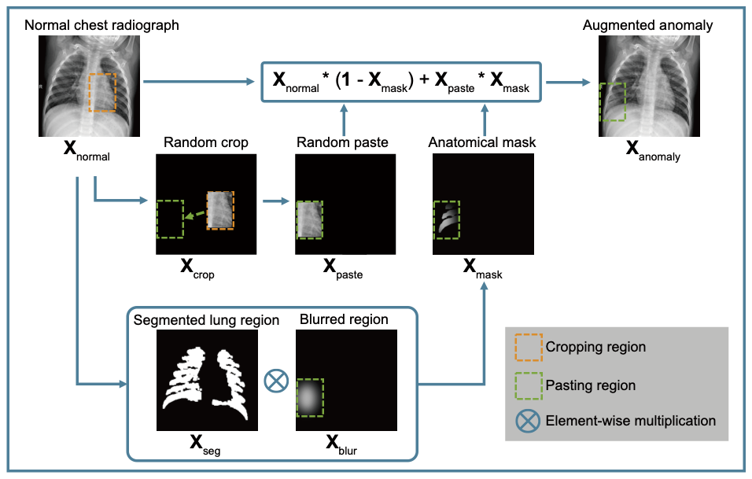
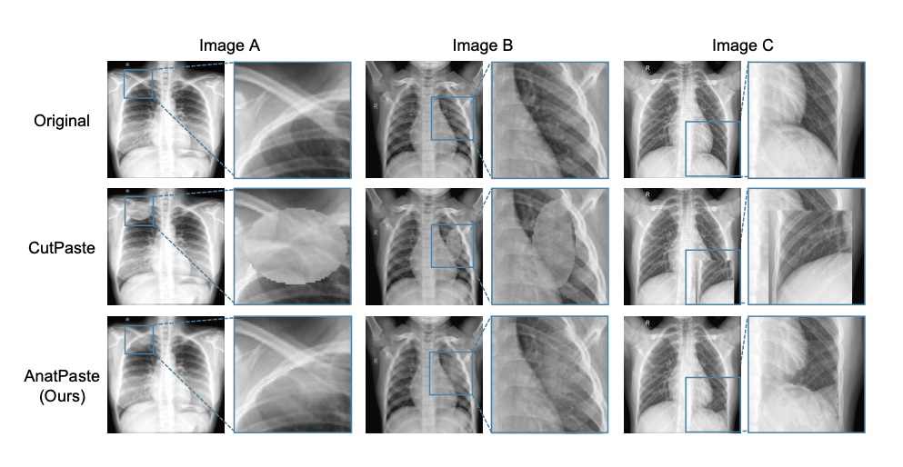

# Implementation of AnatPaste

This is an official PyTorch implementation of [AnatPaste: Anatomy-aware Self-Supervised Learning for Anomaly Detection in chest radiographs](https://arxiv.org/abs/2205.04282v1). This repository is mainly based on [this repository](https://github.com/Runinho/pytorch-cutpaste)

## Setup
Our training environments are listed in environment.yml
This yml suppose cudatoolkit=11.3 and python=3.9. Please install corresponding Pytorch version.  
`conda env create -f=env_name.yml`

## Dataset
After downloading certain dataset and splitting into train,validation and test, you should make the directories as follows,
```
dataset  
 |-----train  
 |        |---normal  
 |  
 |-----valid  
 |        |---normal  
 |        |---abnormal  
 |-----test  
 |        |---normal  
 |        |---abnormal  
```
You must specify the name and absolute path of normal directory in dataset.py and run_training.py and eval.py.The name of abnormal directory is anything you like.
In this github directory, we use Zhanglab, Chexpert, and RSNA dataset, so their normal directory name  good and No Finding, respectively.

## Run Training
```
`python run_training.py --variant anatmix --type zhanglab  --seed 0 --no-pretrained --cuda 0 --batch_size 64 `  
```
and the performance in validation and test set is written as tfrecords in logdirs.

## Flowchart


## Sample imgs



## Results

